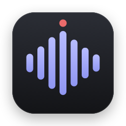
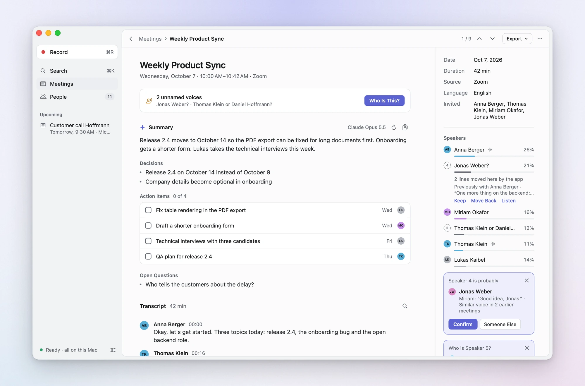
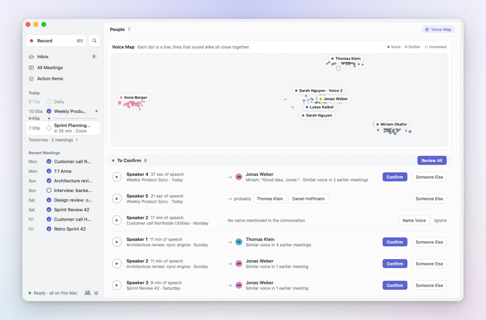
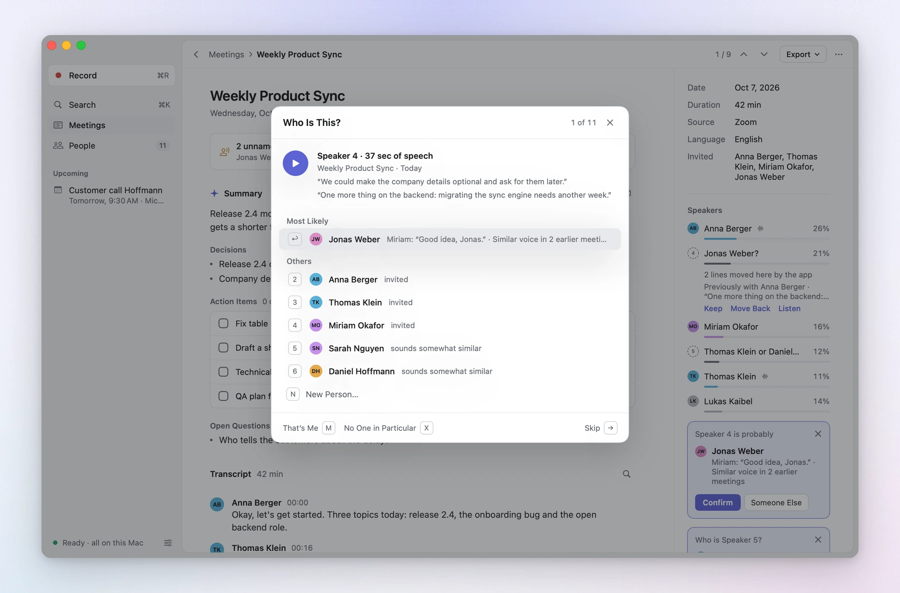
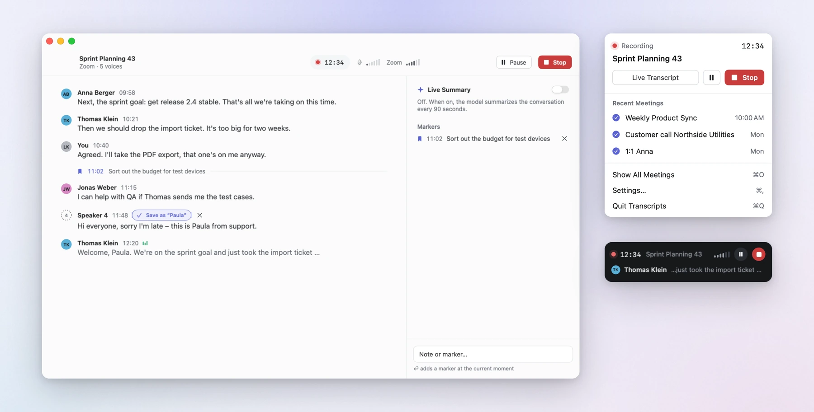
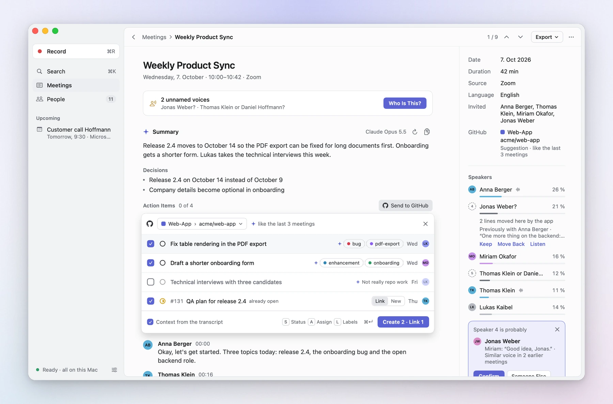
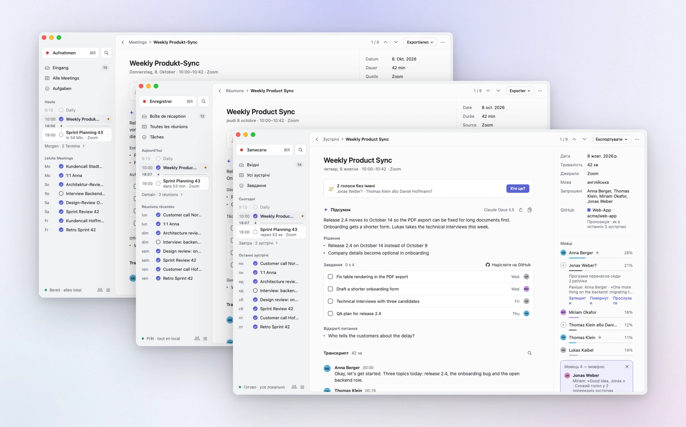

<p align="center">
  <picture>
    <source media="(prefers-color-scheme: dark)" srcset="Design/icon-dark.png">
    
  </picture>
</p>

<h1 align="center">Transcripts</h1>

<p align="center">
  <b>A native Mac app that transcribes your meetings on the Mac itself and learns who is speaking.</b><br>
  A live transcript while you talk, the names of the people on the call, and a summary afterwards if you want one.
</p>

<p align="center">
  
  
  
  
  <a href="LICENSE"></a>
  <a href="CHANGELOG.md"></a>
</p>

<p align="center">
  <a href="https://lukaskaibel.github.io/transcripts-app/"><b>Website</b></a> &nbsp;·&nbsp;
  <a href="#a-quick-tour"><b>Tour</b></a> &nbsp;·&nbsp;
  <a href="#how-the-names-come-about"><b>How names work</b></a> &nbsp;·&nbsp;
  <a href="#languages"><b>Languages</b></a> &nbsp;·&nbsp;
  <a href="#getting-started"><b>Getting started</b></a> &nbsp;·&nbsp;
  <a href="#keyboard"><b>Shortcuts</b></a> &nbsp;·&nbsp;
  <a href="CHANGELOG.md"><b>Changelog</b></a>
</p>

<br>

<picture>
  <source media="(prefers-color-scheme: dark)" srcset="Design/screenshots/meeting-dark.webp">
  
</picture>

> **Status: early.** Version 0.1.0 records, transcribes, names and summarises meetings every day on the maintainer's
> Mac. There are no downloadable builds yet; you build it from source (a few minutes, see below).

## Why

Meeting assistants usually join your call as a bot or upload the recording to a server. This one does neither. It
records the call and your microphone on your Mac, transcribes both there, and learns the voices of the people you
talk to, so the transcript says who said what. Audio, transcripts and voices never leave the Mac; only the transcript
text goes to the summary service you choose, and with a local model not even that. Action items you send to GitHub
yourself take their title, labels and due day along, and in private repositories a line of context with a quote.

## A quick tour

### A meeting, finished when it ends

About half a minute after a call, the meeting is transcribed again in a careful second pass, the voices are told apart
and named, and the summary is written: an overview, decisions, action items with owner and due day, and open
questions. Play any line, set markers while recording, export as Markdown, or search every transcript with ⌘K.

### It learns the voices

Confirm a voice once and the app recognises that person in every later meeting. The People screen lists the voices
waiting for a name, and the voice map shows all of them at once: every line is a dot, lines that sound alike sit
close together. You see at a glance which voices the app could mix up, whose voice falls into two groups (another
microphone), and which lines fit nobody.

<picture>
  <source media="(prefers-color-scheme: dark)" srcset="Design/screenshots/people-dark.webp">
  
</picture>

### "Who is this?"

After a meeting the app asks about the voices it doesn't know, one after another, with a sample playing and its
likely names first. A number key or Return names the voice; M is you, X nobody in particular.

<picture>
  <source media="(prefers-color-scheme: dark)" srcset="Design/screenshots/naming-dark.webp">
  
</picture>

### While you record

A menu bar item and a small floating recorder you can put anywhere; the live window when you want to read along,
with names after a few seconds, a live summary if you like, and markers with a note.

<picture>
  <source media="(prefers-color-scheme: dark)" srcset="Design/screenshots/recording-dark.webp">
  
</picture>

### Action items into GitHub

*Send to GitHub* turns a meeting's action items into issues, in a popover that works like a new issue in
[Issues for GitHub](https://github.com/lukaskaibel/issues-for-github): the project and repository on top, and for each
task its status, assignees and labels, each picked from a search field that has the keyboard at once (S, A, L, then
⌘Return). The app remembers where a calendar series, a meeting title or a group of people sent their tasks and
proposes that place next time; it finds people's GitHub accounts by their names, and links a task to the issue that is
already open instead of creating it twice. The summary's model picks labels from the repository's own and leaves out
tasks that aren't work for it. Back in the meeting, each task shows its issue's number and status, is checked off when
the issue is closed, and closes the issue when you check it off.

<picture>
  <source media="(prefers-color-scheme: dark)" srcset="Design/screenshots/github-dark.webp">
  
</picture>

### In your language

The interface speaks English, German, French, Spanish, Italian, Portuguese, Dutch, Polish, Russian and Ukrainian:
the languages its speech recognition transcribes best. It follows macOS, or the language you pick in Settings.



## What it does

- **Records the call and you separately.** Your microphone and everything the Mac plays (Zoom, Teams, Meet in the
  browser, …) are two tracks, taken with a Core Audio process tap. No virtual audio driver, and the app knows for
  certain which lines are yours.
- **Works with speakers, not just headphones.** After a meeting the call's echo is taken out of your microphone
  track, predicted from the call track itself, so playback has every voice once and your own lines stay complete.
- **Transcribes on the Mac.** NVIDIA's Parakeet model runs on the Neural Engine through
  [FluidAudio](https://github.com/FluidInference/FluidAudio): a live transcript while you talk, and a second, careful
  pass when the meeting ends. 25 European languages, also mixed in one meeting.
- **Tells the voices apart and learns them.** Every line gets its own voice fingerprint; a clear match with a known
  person is named automatically, a weaker one is suggested, and an unsure one reads "Hai or Julian?". Names from the
  conversation ("Thomas, does that work for you?", "this is Paula") and the calendar's invitees become suggestions you
  accept with one click.
- **Knows your calendar.** Meetings are named after the event and know who was invited. When a meeting starts you get
  a notification with a *Record* button. Calls without a calendar event are noticed too, and you're reminded to stop
  when the call is over. Events of shared calendars that you aren't invited to stay out, and *Not my meeting* hides
  any other series or a whole calendar.
- **Summarises, if you want.** Overview, decisions, action items and open questions from Anthropic, OpenAI, Google or
  a local model in Ollama, automatically after each meeting or on request, plus an optional live summary while
  recording. In the meeting's language or one you choose. API keys stay in the Keychain.
- **Sends action items to GitHub.** As issues in the project and repository the meeting's series or people used
  before, with status, assignees and labels, linked instead of duplicated, and kept in step: closed there, checked
  off here. Signs in through the GitHub CLI, like Issues for GitHub.
- **Keeps an archive you can search.** Meetings grouped by day, full-text search through every transcript, playback
  from any line, Markdown export, and import of audio or video files (voice memos, Zoom recordings, a meeting recorded
  in a room).
- **Native.** Swift and SwiftUI, light and dark, four app icons in Apple's style (automatic, light, dark, indigo).
  Apple silicon only.

## How the names come about

1. **Two tracks.** Everything on the microphone track is you; the call track holds everyone else. With speakers
   instead of headphones the call comes back into the microphone; after the meeting that echo is taken out of your
   track, predicted from the call track itself (delay, room and level per frequency band). Echoes that still made it
   into the transcript are dropped.
2. **Separating voices.** The diarizer (pyannote community-1 with VBx clustering) splits the call track into voices.
   Its turns are then checked against the voices the app already knows, line by line: a voice that turns out to be two
   known people is split, and someone who introduces themselves by another name is someone else, however alike they
   sound.
3. **Recognising voices.** Every line of the transcript gets its own voice embedding (256 dimensions), and a person is
   all the lines assigned to them. Their lines are grouped by sound: the main group is their voice; a second big one is
   the same person sounding different (another microphone) or, if it sounds clearly unlike the first, perhaps someone
   else under their name, which the person's page points out. Small groups that fit nothing are strays (a cough,
   crosstalk, a line of someone else) and don't count. A clear match with one of a known person's voices is named
   automatically; a weaker one becomes a suggestion. How bold the app is can be set in Settings › Voices (*Cautious*,
   *Balanced*, *Generous*).
4. **Names from the conversation.** Introductions, people addressed by name, "thanks, Jonas" and the calendar's
   invitees become suggestions, in all ten interface languages, including names that change when someone is called by
   them (Polish "Anno" for Anna, Ukrainian "Олено" for Олена).
5. **Only what you confirm defines a voice.** Recognised lines may refine a voice you confirmed, so it can change over
   time, but never start one. After every confirmation or correction every voice you haven't settled is judged again,
   so a wrong name doesn't carry on: correct it once, and what followed from it follows the correction. A speaker whose
   lines sound like two voices shows both in the meeting; each can be played and given to someone on its own, which
   splits the speaker in the transcript.
6. **Lines in the wrong place move.** When some lines of one speaker sound as clearly like another known person as an
   automatic name needs, the app moves them there, marked, with *Keep* and *Move Back*. Moved lines count only as
   recognised speech, so a wrong move teaches nothing.
7. **Unsure is said out loud.** A voice that may be one of a few people is shown as "Hai or Julian?", with a button for
   each, and the summary reads "Speaker 2 (maybe Hai or Julian)", so nothing is lost and nothing is named wrongly.

During the recording the same happens in small: known voices are named after a few seconds, and each line is checked
on its own. The pass after the meeting sees the whole recording and is more accurate.

## Languages

The app speaks only the languages that both halves of it handle well. Speech recognition decides: Parakeet v3 gets
fewer than 8 % of the words wrong in these ten on the FLEURS benchmark, and between 9 and 24 % in its fifteen other
languages. Recognising voices works on the sound of a voice, whatever the language.

| Language | Words wrong (FLEURS) | | Language | Words wrong (FLEURS) |
|---|---|---|---|---|
| Italian | 3.0 % | | French | 5.2 % |
| Spanish | 3.5 % | | Russian | 5.5 % |
| Portuguese | 4.8 % | | Ukrainian | 6.8 % |
| English | 4.9 % | | Polish | 7.3 % |
| German | 5.0 % | | Dutch | 7.5 % |

Everything follows the language: the interface with its plural forms and quotation marks, dates and numbers in your
region's format, the names spotted in the conversation, and the summary, which is written in the meeting's language or
the one you choose in Settings › AI. On a Mac set to another language the interface is in English; meetings in
Parakeet's fifteen other languages are still transcribed, just less reliably.

## Getting started

You need a Mac with Apple silicon, macOS 26 or later and Xcode 27.

```bash
git clone https://github.com/lukaskaibel/transcripts-app.git
cd transcripts-app
open Transcripts.xcodeproj
```

1. Copy `Config/Local.xcconfig.example` to `Config/Local.xcconfig` and enter your Apple Developer team, so the app is
   signed with your certificate (macOS remembers permissions per signature).
2. Run the *Transcripts* scheme (⌘R in Xcode).
3. The first window walks you through the rest: your name, microphone, calendar and notifications. It also downloads
   the speech models once (about 700 MB, to `~/Library/Application Support/FluidAudio/Models`). macOS asks for
   *system audio recording* the first time you record.
4. For summaries, open Settings › AI and enter an API key, or point it at Ollama.
5. For GitHub, click *Send to GitHub* above a meeting's action items, or open Settings › GitHub. Transcripts uses the login
   of the GitHub CLI (`gh auth login`; scopes `repo`, `project` and `read:org`), as Issues for GitHub does. To sign in
   on github.com with a code instead, set `GITHUB_CLIENT_ID` in `Config/Local.xcconfig` to a GitHub OAuth app with the
   device flow turned on.

Tip: set the notification style for Transcripts to *Persistent* in System Settings › Notifications, so the "… is
starting. Start recording?" reminder stays until you click it.

To try the app without touching your data, start it in demo mode: `-demo YES` as a launch argument (in the scheme, or
`open Transcripts.app --args -demo YES`). It runs on made-up meetings in memory, in English, or in German when the
interface is German. Add `-AppleLanguages "(fr)"` to see it in another language.

### Keyboard

| Keys | |
| --- | --- |
| ⌘R | Start or stop recording |
| ⇧⌘P | Pause or resume |
| ⇧⌘M | Add a marker |
| ⌘L | Live window |
| ⌘K | Search and commands |
| ⌘1 – ⌘4 | Inbox / All Meetings / Action Items / People |
| ⌘↑ / ⌘↓ | Previous / next meeting |
| ⌘F | Find in the transcript |
| Space | Play or pause the recording |
| ⌘I | Import an audio or video file |
| 1–9, Return, M, X, → | In *Who Is This?*: pick a name, the most likely one, you, nobody in particular, skip |
| ⇧⌘G | Send the meeting's action items to GitHub |
| ↑↓, Space, S, A, L, Z, Return, ⌘Return | In *Send to GitHub*: move between the tasks, include one or not, its status, assignees, labels, where they go, edit the title, create |

## Testing

```bash
cd Packages/TranscriptsKit && swift test
```

146 tests with Swift Testing: transcript assembly, voice grouping, profiles, the re-check after corrections and moving
misplaced lines, voice refinement, name evidence in all ten languages, the live line check, echo removal and the repair
of old call tracks (on synthetic speech), the summary providers (with mocked HTTP), the database, audio files and the
app's actions.

The pipeline also runs on the command line, on real audio:

```bash
cd Packages/TranscriptsKit && swift build && .build/debug/transcripts-cli models
```

`transcripts-cli` has `transcribe`, `diarize`, `live`, `process`, `record` (a whole recording, played from files faster
than real time), `confirm`, `summarize`, `voices` (everyone's voice groups, and each meeting's speakers with the groups
of their lines) and `maintain`; see the top of `Sources/transcripts-cli/main.swift`. `Tools/make-test-meeting.py` builds
German test meetings with known speakers and a `truth.json`.

Results on a MacBook Pro with M4 Pro and 24 GB, with synthetic test meetings (one natural German voice, shifted in pitch
per person, which makes the voices harder to tell apart than real people):

| Meeting | Voices found | Text with the right voice |
| --- | --- | --- |
| 5 people, 1.5 min | 5 for 5 | 100 % |
| 5 people, 30 min | 5 for 5 | 100 % |
| 6 people, poor call audio, one joins late, no known voices | 4 for 6 | 86 % |
| the same, after confirming the voices of the first meeting | 6 for 6 | 100 % (4 named automatically, 1 suggested from her introduction) |
| 5 people recorded in a room (one track), known voices | 5 for 5 | 99–100 % |

Speed: a 30-minute meeting is finished about 30 seconds after it ends (about 65 times real time, up to 1.3 GB of
memory). The live transcript keeps up with several times real time.

## For contributors

```
Transcripts/                  App target: entry point, icons, the string catalogs (Localizable, InfoPlist)
Packages/TranscriptsKit/      Everything else, as a Swift package
  Sources/TranscriptsKit/
    Audio/                    Microphone, system audio tap, echo removal, audio files
    Speech/                   Speech recognition, voice activity, diarization (FluidAudio)
    Recording/                The running recording and its live transcript
    Pipeline/                 Processing after a meeting: assembly, refinement, archiving
    Speakers/                 Voice profiles, name evidence, identification, re-checks, live line check
    Calendar/                 Calendar, reminders, call detection
    AI/                       Summary providers and prompts
    Model/  Store/            Records and the GRDB database with full-text search
    App/  UI/                 App model, settings, scenes; SwiftUI views
    Support/                  Paths, formatting, the languages the app speaks
  Sources/transcripts-cli/    The pipeline on the command line
  Tests/TranscriptsKitTests/
Packages/Vendor/FluidAudio/   FluidAudio, vendored (see below)
Config/                       Build settings, Info.plist, entitlements
Tools/                        App icons, test meetings, screenshots, README and website pictures, translations
Design/                       Icon, README pictures, social preview
Website/                      The website on GitHub Pages: home, privacy policy, terms, support, Impressum
```

The interface texts are written in German in the code and translated in `Transcripts/Localizable.xcstrings`. After
changing texts, `Tools/localization/extract.sh` brings the catalog up to date; `Tools/localization/catalog.py` lists
what a language lacks, takes translations in and checks placeholders and plural forms. The pictures in this README are
made by `Tools/readme-images.sh`: the app renders its own windows in demo mode, in light and dark,
`Tools/readme-images/build.py` lays them out, and `Tools/readme-images/website.py` makes the website's pictures from
the same windows. See [CONTRIBUTING.md](CONTRIBUTING.md) for how to propose changes.

The [website](https://lukaskaibel.github.io/transcripts-app/) is plain HTML and CSS in `Website/`, without a build
step; `.github/workflows/website.yml` publishes it to GitHub Pages when it changes on `main`. To look at it locally:

```bash
python3 -m http.server --directory Website
```

Data lives in `~/Library/Application Support/Transcripts` (the database and the recordings, compressed to AAC after
processing; keep them forever, for 30 days, or not at all). API keys are in the Keychain.

## Good to know

- Issues in public repositories never get context or quotes from the transcript, only title, labels and due day.

- The speaker names in the live window are provisional; similar voices can share a name until the pass after the
  meeting sorts them out.
- Without any known voices, two people who sound very much alike can end up as one voice. Confirming a few voices
  fixes that for later meetings.
- Local summaries need a model that fits into memory next to everything else. On a 24 GB Mac a 27B model is far too
  slow; a model of roughly 8 to 14B parameters is the sweet spot. The app turns off Ollama's "thinking" for summaries.
- Summaries default to Claude Opus 5.5. If a safety classifier declines a request, Anthropic re-runs it on a fallback
  model (the `server-side-fallback` beta), so a summary doesn't fail for that reason.

## Versions

The project follows [semantic versioning](https://semver.org). Every release is tagged (`v0.1.0`) and described in the
[changelog](CHANGELOG.md). Until 1.0, minor versions may change behaviour.

## Acknowledgements

Built with [FluidAudio](https://github.com/FluidInference/FluidAudio) (Apache 2.0), vendored in
`Packages/Vendor/FluidAudio` at the commit in `UPSTREAM_COMMIT`, without its NemoTextProcessing binary; its licences
for third-party parts are in `ThirdPartyLicenses`. It runs NVIDIA's Parakeet speech recognition and pyannote's and
WeSpeaker's voice models, downloaded from FluidAudio's Hugging Face repositories, where their licences are listed. The
database is [GRDB](https://github.com/groue/GRDB.swift) (MIT).

## License

[MIT](LICENSE) © Lukas Kaibel
