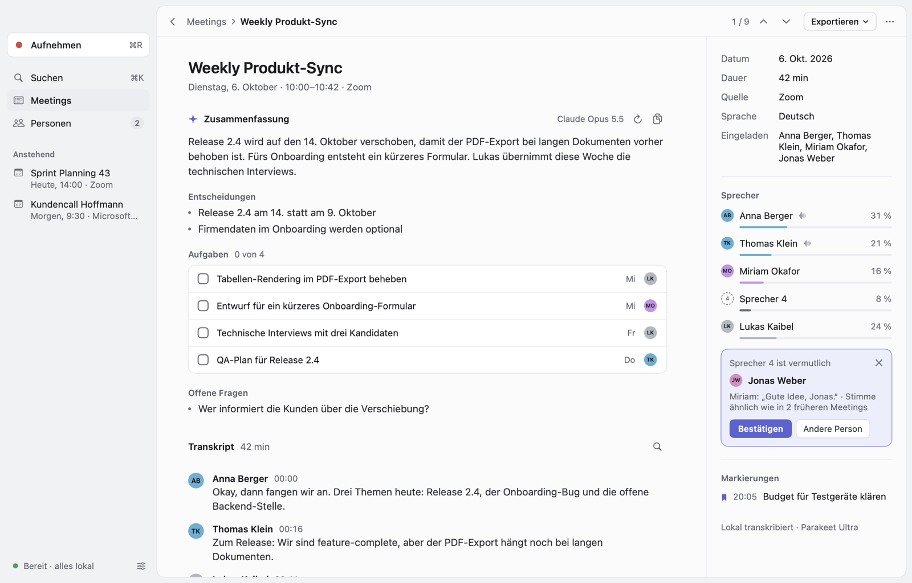
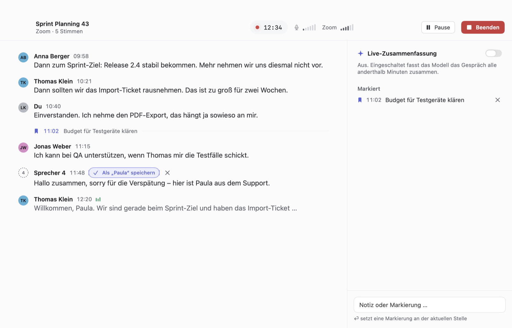
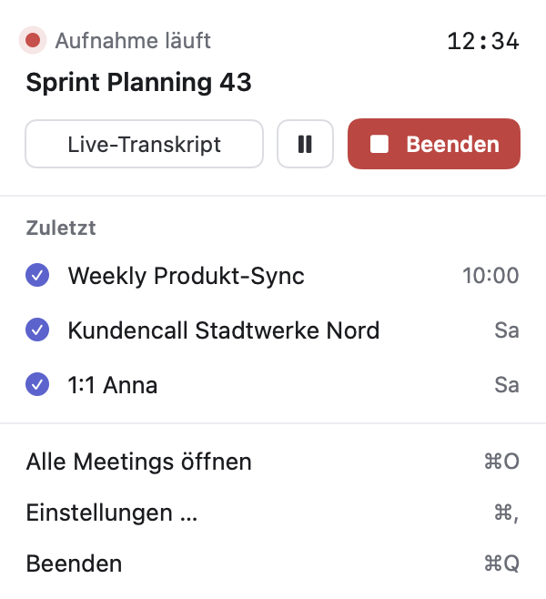
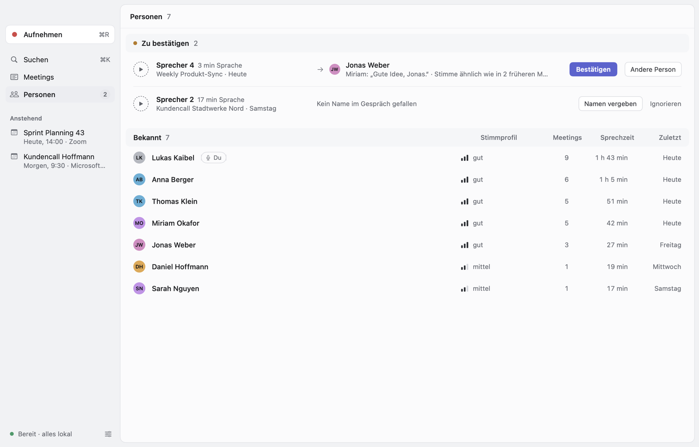

<p align="center">
  <picture>
    <source media="(prefers-color-scheme: dark)" srcset="Design/icon-dark.png">
    
  </picture>
</p>

<h1 align="center">Transcripts</h1>

<p align="center">
  <b>A native Mac app that transcribes your meetings on the Mac itself and learns who is speaking.</b><br>
  Live transcript while you talk, the names of the people on the call, and an optional AI summary afterwards.
</p>

<p align="center">
  
  
  
  
</p>

<br>

<picture>
  <source media="(prefers-color-scheme: dark)" srcset="Design/screenshots/meeting-dark.png">
  
</picture>

## What it does

- **Records the call and you separately.** Your microphone and everything the Mac plays (Zoom, Teams, Meet in
  the browser, …) are two tracks, taken with a Core Audio process tap. No virtual audio driver, and the app knows
  for certain which lines are yours.
- **Transcribes on the Mac.** NVIDIA's Parakeet model runs on the Neural Engine through
  [FluidAudio](https://github.com/FluidInference/FluidAudio): a live transcript while you talk, and a second,
  careful pass when the meeting ends. 25 European languages, also mixed; German and English work well.
- **Tells the voices apart and learns them.** After the meeting the voices are separated (pyannote
  community-1 with VBx clustering). Confirm a voice once and the app recognises that person in every later
  meeting, even on a bad connection. Names from the conversation ("Thomas, passt das für dich?", "hier ist Paula")
  and the calendar invitees become suggestions you accept with one click.
- **Knows your calendar.** Meetings are named after the event and know who was invited. When a meeting starts you
  get a notification with a *Start recording* button. Calls without a calendar event (Zoom, Teams, Meet, …) are
  noticed too, and you're reminded to stop when the call is over.
- **Summarises, if you want.** Overview, decisions, tasks with owner and due day, and open questions, from
  Anthropic, OpenAI, Google or a local model in Ollama. Automatically after each meeting or on request, plus an
  optional live summary while recording. API keys stay in the Keychain.
- **Keeps an archive you can search.** Meetings grouped by day, full-text search through every transcript (⌘K),
  playback from any line, markers and notes set during the recording, Markdown export, and import of audio or
  video files (voice memos, Zoom recordings, a meeting recorded in a room).
- **Stays out of the way.** A menu bar item and a small floating recorder; the live window when you want to read
  along.

Audio, transcripts and voices never leave the Mac. Only the transcript text goes to the summary service you pick,
and with Ollama not even that.

<table>
  <tr>
    <td width="58%"></td>
    <td></td>
  </tr>
</table>



## Getting started

You need a Mac with Apple silicon, macOS 26 or later and Xcode 27.

1. Copy `Config/Local.xcconfig.example` to `Config/Local.xcconfig` and enter your Apple Developer team, so the app
   is signed with your certificate (macOS remembers permissions per signature).
2. Open `Transcripts.xcodeproj` and run the *Transcripts* scheme.
3. The first window walks you through the rest: your name, microphone, calendar and notifications. It also
   downloads the speech models once (about 700 MB, to `~/Library/Application Support/FluidAudio/Models`). macOS
   asks for *system audio recording* the first time you record.
4. For summaries, open Settings → KI and enter an API key, or point it at Ollama.

Tip: set the notification style for Transcripts to *Hinweise* (alerts) in System Settings, so the
"Meeting beginnt – Aufnehmen?" notification stays until you click it.

To try the app without touching your data, start it in demo mode: `-demo YES` as a launch argument (in the
scheme, or `open Transcripts.app --args -demo YES`). It runs on made-up meetings in memory.

### Keyboard

| Keys | |
| --- | --- |
| ⌘R | Start or stop recording |
| ⇧⌘P | Pause or resume |
| ⇧⌘M | Set a marker |
| ⌘L | Live window |
| ⌘K | Search and commands |
| ⌘1 / ⌘2 | Meetings / People |
| ⌘↑ / ⌘↓ | Previous / next meeting |
| ⌘F | Find in the transcript |
| Space | Play or pause the recording |
| ⌘I | Import an audio or video file |

## How the names come about

1. **Two tracks.** Everything on the microphone track is you; the call track holds everyone else. Lines of the call
   that come back through your microphone (speakers instead of headphones) are dropped as echoes.
2. **Separating voices.** The diarizer splits the call track into voices. Its turns are then checked against the
   voices the app already knows, line by line: a voice that turns out to be two known people is split, and someone
   who introduces themselves by another name is someone else, however alike they sound.
3. **Recognising voices.** Every voice is a 256-dimensional embedding. A clear match with a known person (similar
   enough and clearly ahead of the next best) is named automatically; a weaker one becomes a suggestion. How
   bold the app is can be set in Settings → Stimmen (*Vorsichtig*, *Ausgewogen*, *Großzügig*).
4. **Names from the conversation.** Introductions, people addressed by name, "danke, Jonas" and the calendar's
   invitees become suggestions. Confirming one teaches the app that voice, and other meetings' unknown voices are
   checked against it right away.

During the recording the same happens in small: known voices are named after a few seconds, and each line is
checked on its own. The pass after the meeting sees the whole recording and is more accurate.

## Testing

```bash
cd Packages/TranscriptsKit && swift test
```

96 tests with Swift Testing: transcript assembly, voice library and refinement, name evidence, the live line check,
the summary providers (with mocked HTTP), the database, audio files and the app's actions.

The pipeline also runs on the command line, on real audio:

```bash
cd Packages/TranscriptsKit && swift build && .build/debug/transcripts-cli models
```

`transcripts-cli` has `transcribe`, `diarize`, `live`, `process`, `record` (a whole recording, played from files
faster than real time), `confirm` and `summarize`; see the top of `Sources/transcripts-cli/main.swift`.
`Tools/make-test-meeting.py` builds German test meetings with known speakers and a `truth.json`, and
`Tools/screenshots/run.sh` drives the app in demo mode and has it render its windows to PNGs (also with a locked
screen). The app icon is an Icon Composer document drawn by `Tools/make-icon.swift`; `Tools/render-icons.sh` renders
it for this page.

Results on a MacBook Pro with M4 Pro and 24 GB, with synthetic test meetings (one natural German voice, shifted in
pitch per person, which makes the voices harder to tell apart than real people):

| Meeting | Voices found | Text with the right voice |
| --- | --- | --- |
| 5 people, 1.5 min | 5 for 5 | 100 % |
| 5 people, 30 min | 5 for 5 | 100 % |
| 6 people, poor call audio, one joins late, no known voices | 4 for 6 | 86 % |
| the same, after confirming the voices of the first meeting | 6 for 6 | 100 % (4 named automatically, 1 suggested from her introduction) |
| 5 people recorded in a room (one track), known voices | 5 for 5 | 99–100 % |

Speed: a 30-minute meeting is finished about 30 seconds after it ends (about 65 times real time, up to 1.3 GB of
memory). The live transcript keeps up with several times real time.

## Project layout

```
Transcripts/                  App target: entry point and assets
Packages/TranscriptsKit/      Everything else, as a Swift package
  Sources/TranscriptsKit/
    Audio/                    Microphone, system audio tap, audio files
    Speech/                   Speech recognition, voice activity, diarization (FluidAudio)
    Recording/                The running recording and its live transcript
    Pipeline/                 Processing after a meeting: assembly, refinement, archiving
    Speakers/                 Voice library, name evidence, identification, live line check
    Calendar/                 Calendar, reminders, call detection
    AI/                       Summary providers and prompts
    Model/  Store/            Records and the GRDB database with full-text search
    App/  UI/                 App model, settings, scenes; SwiftUI views
  Sources/transcripts-cli/    The pipeline on the command line
  Tests/TranscriptsKitTests/
Packages/Vendor/FluidAudio/   FluidAudio, vendored (see below)
Config/                       Build settings, Info.plist, entitlements
Tools/                        App icon, test meetings, screenshot tour
Design/                       Icon and screenshots for this page
```

Data lives in `~/Library/Application Support/Transcripts` (the database and the recordings, compressed to AAC
after processing; keep them forever, for 30 days, or not at all). API keys are in the Keychain.

## Good to know

- The speaker names in the live window are provisional; similar voices can share a name until the pass after the
  meeting sorts them out.
- Without any known voices, two people who sound very much alike can end up as one voice. Confirming a few voices
  fixes that for later meetings.
- Local summaries need a model that fits into memory next to everything else. On a 24 GB Mac a 27B model is far
  too slow; a model of roughly 8 to 14B parameters is the sweet spot. The app turns off Ollama's "thinking" for
  summaries.
- Summaries default to Claude Opus 5.5. If a safety classifier declines a request, Anthropic re-runs it on a
  fallback model (the `server-side-fallback` beta), so a summary doesn't fail for that reason.

## Third-party code

- [FluidAudio](https://github.com/FluidInference/FluidAudio) (Apache 2.0) is vendored in `Packages/Vendor/FluidAudio`
  at the commit in `UPSTREAM_COMMIT`, without its NemoTextProcessing binary (text normalisation isn't needed here).
  Its licences for third-party parts are in `ThirdPartyLicenses`. The models it downloads come from FluidAudio's
  Hugging Face repositories, where their licences are listed.
- [GRDB](https://github.com/groue/GRDB.swift) (MIT) for the database.
